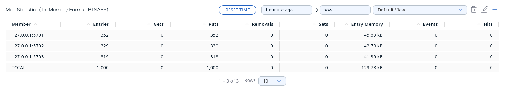
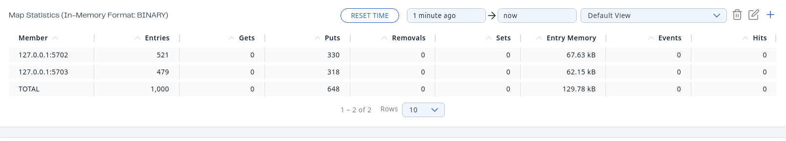
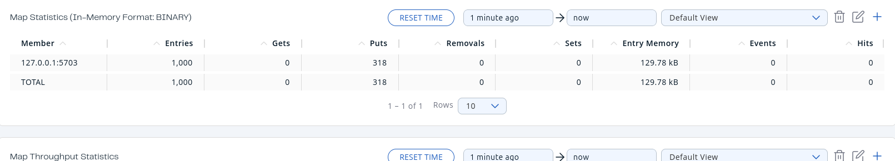
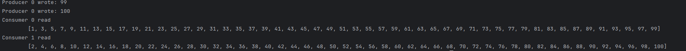

# Lab2: Hazelcast

## Usage
1. Start Hazelcast using 
   ```bash
   control.sh -s|--start
   ```
2. Start Hazelcast Management Center using 
   ```bash
   hz-mc start
   ```
3. Run python files
   ```bash
   python3 ./python/map.py
   ```
   ```bash
   python3 ./python/map_blocking.py [-h] (-n | -o | -p)
   ```
   ```bash
   python3 ./python/queue.py [-h] [-c --consumers] [-p --producers]
   ```
4. Stop Hazelcast
   ```bash
   control.sh -k|--kill
   ```

## Tasks
### Task 1: Install Hazelcast
Installed Hazelcast on Ubuntu using 
```bash
wget -qO - https://repository.hazelcast.com/api/gpg/key/public | gpg --dearmor | sudo tee /usr/share/keyrings/hazelcast-archive-keyring.gpg > /dev/null
echo "deb [signed-by=/usr/share/keyrings/hazelcast-archive-keyring.gpg] https://repository.hazelcast.com/debian stable main" | sudo tee -a /etc/apt/sources.list
sudo apt update && sudo apt install hazelcast=5.5.0
```
Installed Manage Center using
```bash
wget -qO - https://repository.hazelcast.com/api/gpg/key/public | sudo apt-key add -
echo "deb https://repository.hazelcast.com/debian stable main" | sudo tee -a /etc/apt/sources.list
sudo apt update && sudo apt install hazelcast-management-center=5.7.1
```
### Task 2: Configure and run 3 nodes
The configuration file is `config.xml`. Use `control.sh` to run 3 nodes as separate applications
### Task 3: Distributed Map
The `./python/map.py` file writes 1000 values to `distribMap`

### Task 3.1: Kill one node
The `controll.sh` returned PIDs of the nodes, so I can use `kill -9 <PID>` to stop nodes. The result after killing one 
node is following

### Task 3.2: Kill second node
The result after killing second node is folowing

No data loss observed. Though it took some time to restore data
### Task 3.3 Kill two nodes simultaneously

When two nodes were killed some data was lost. To avoid data loss in the system with 3 nodes, the `backup-count` can be 
set to 2 in `config.xml`. Then 2 reserve copies will be created and at least one will be in the node that will be left
```xml
<map name="default">
    <backup-count>2</backup-count>
</map>
```
### Task 4: Distributed map without locks
To increment with 3 clients without blocking use `python3 map_blocking.py -n|--none`. The result is
```
The value: 13238
Time: 7.258609294891357

```
This is due to data race that appears when multiple clients write to a shared resource. The expected value is a bit 
higher than the value of one client
### Task 5: Pessimistic blocking
To increment with 3 clients without blocking use `python3 map_blocking.py -p|--pessimistic`. The result is
```
The value: 30000
Time: 16.774216890335083
```
No datarace, the computatyiom time is longer than without blocking
### Task 6: Optimistic blocking
To increment with 3 clients without blocking use `python3 map_blocking.py -o|--optimistic`. The result is
```
The value: 30000
Time: 14.837647914886475
```
No datarace, the computatyiom time is longer than without blocking
### Task 7: Compare optimistic vs pessimistic blocking
The optimistic blocking is faster by approximately 1.9 seconds 
### Task 8: Bounded queue
To test queue use `python3 queue.py -c|--concumers <consumers_num> -p|--procucers <producers_num>`. The results show 
that the consumer clients are run one-after-another. Thus in case with 2 consumers one has even and the other odd 
numbers. In case with 3 consumers same pattern is observed



If the program run without consumers, the producer is blocked when the boundary is reached

